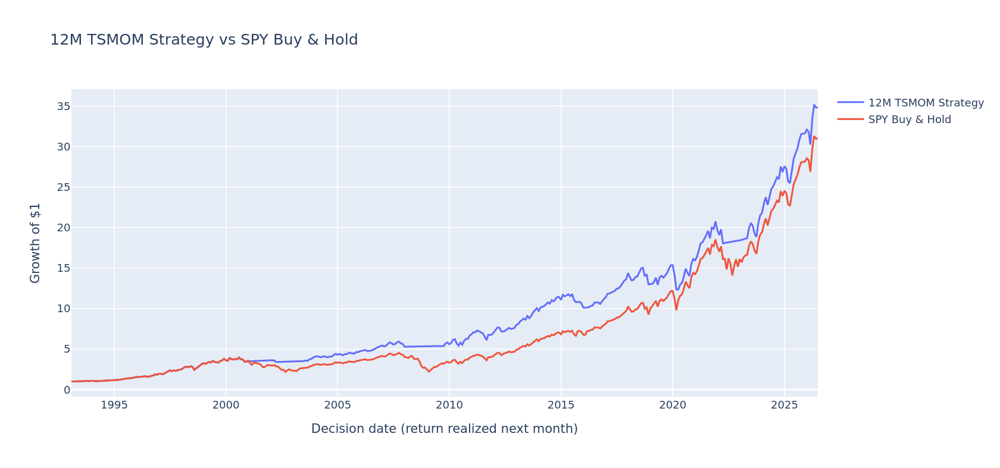

# 12-Month Time-Series Momentum on the S&P 500

Does a positive return over the past 12 months predict stronger future returns? Can a simple monthly timing rule improve the balance between return and risk?

This project studies those questions using the S&P 500 Total Return Index and an implementation with SPY. **The momentum effect is not statistically significant after HAC correction. The strategy's most consistent historical benefit is lower risk; its return advantage varies over time.**

Open the [research notebook](notebooks/01_momentum_research.ipynb) for the calculations and interactive Plotly charts.

## Data

| Input | Use | Snapshot |
| --- | --- | --- |
| S&P 500 Total Return Index (`^SP500TR`), downloaded with yfinance | Signal and statistical analysis, using `Close` | January 1988–July 2026 |
| SPY, downloaded with yfinance | Tradable proxy, using `Adj Close` | January 1993–July 2026 |
| `RF` from `F-F_Research_Data_Factors.csv` | Monthly cash returns and excess returns | File ending in July 2026 |

Daily prices are resampled to the last observation each month. Removing unavailable returns leaves 450 one-month and 448 three-month observations. The SPY implementation has 402 monthly returns.

## Method and statistical results

The analysis compares forward returns after positive and nonpositive 12-month returns using descriptive statistics, a one-sided Welch test, regression diagnostics, and OLS with HAC (Newey–West) standard errors. Three-month forward returns overlap.

| Forward horizon | Difference in group means | HAC lags | Two-sided HAC p-value |
| --- | ---: | ---: | ---: |
| 1 month | +0.82 percentage points | 6 | 0.314 |
| 3 months | +2.37 percentage points | 2 | 0.218 |

The Welch p-value is 0.136. Ordinary OLS gives a three-month p-value near 0.010, but significance disappears with HAC. The alternative HAC lag choices also give p-values above 0.05.

## Trading rule and implementation

- Hold the market when the index's 12-month total return is positive; otherwise hold cash. Rebalance monthly, with no short selling or leverage.
- Apply each signal to the following month's return. The initial index backtest assumes zero cash returns; the next version includes monthly `RF`.
- For SPY, keep the index signal and use SPY adjusted-close returns. Convert `RF` from percent to decimal and align it with the holding period.
- Charge **0.16 bps per one-way entry or exit**, including initial entry, with no final liquidation charge. SPY buy and hold has no cost deduction.
- Use month-end prices without a separate execution delay. Costs are fixed assumptions; individual execution frictions are not estimated separately.

CAGR compounds returns; volatility is annualized with the square root of 12. Sharpe uses monthly excess returns. Drawdowns use monthly wealth peaks.

## Robustness and stability over time

The **6-, 9-, 12-, and 18-month** signals use a common index sample starting in July 1990. In this sample, the 12-month rule has the highest CAGR and Sharpe ratio among the four tested windows; all four have lower volatility and smaller drawdowns than buy and hold. This comparison is a sensitivity check, not a parameter optimization or out-of-sample test.

At costs of **0, 0.16, 1, and 5 bps**, strategy CAGR ranges from about **11.18% to 11.15%**. Low turnover—18 position changes plus initial entry—limits the effect of the tested costs.

The SPY sample is divided into three consecutive periods of 134 months, each evaluated from an initial wealth of 1:

| Decision dates | Strategy CAGR | SPY CAGR | Strategy Sharpe | SPY Sharpe |
| --- | ---: | ---: | ---: | ---: |
| Jan 1993–Feb 2004 | 13.40% | 10.72% | 0.794 | 0.496 |
| Mar 2004–Apr 2015 | 9.98% | 7.87% | 0.840 | 0.512 |
| May 2015–Jun 2026 | 10.19% | 13.87% | 0.664 | 0.801 |

In the latest period, volatility is **12.86% versus 15.16%**, and maximum drawdown is **−19.45% versus −23.93%**. There are 10 signal changes versus four in each earlier period, with several brief exits consistent with more whipsaw.

Dates refer to decisions; returns are realized the following month. The final June 2026 row includes July 2026's return.



[Drawdowns](figures/drawdowns.png) · [CAGR by subperiod](figures/cagr_by_subperiod.png)

## Limitations and conclusion

The project covers one market, has no untouched out-of-sample period, and simplifies execution and cash returns. Monthly observations miss intramonth losses. Performance varies substantially over time.

The full SPY sample shows a small CAGR advantage and better risk measures, but the latest period has lower CAGR and Sharpe than SPY. **Lower risk is the more consistent historical benefit.** These findings do not establish future performance or a permanent change in market behavior.

## Run the project

Use Python 3.12. From the repository root:

```bash
python -m venv .venv
source .venv/bin/activate
python -m pip install -r requirements.txt
python -m jupyter lab notebooks/01_momentum_research.ipynb
```

All three original CSV snapshots are included in `data/`. Restart the kernel and run all cells. The complete calculation was rerun from these fixed input files to confirm that the key results are reproducible. See the [data notes](data/README.md) for details on the input snapshots.

| Path | Contents |
| --- | --- |
| `notebooks/01_momentum_research.ipynb` | Research, saved outputs, and three Plotly charts |
| `data/` | Fixed input snapshots and input requirements |
| `figures/` | Static previews of the same three charts |
| `requirements.txt` | Python dependencies |

Background reading recorded in the original notebook: Moskowitz, Ooi & Pedersen (2012), *Time Series Momentum*; *A Century of Evidence on Trend-Following Investing*. This project is not a replication of either study.
